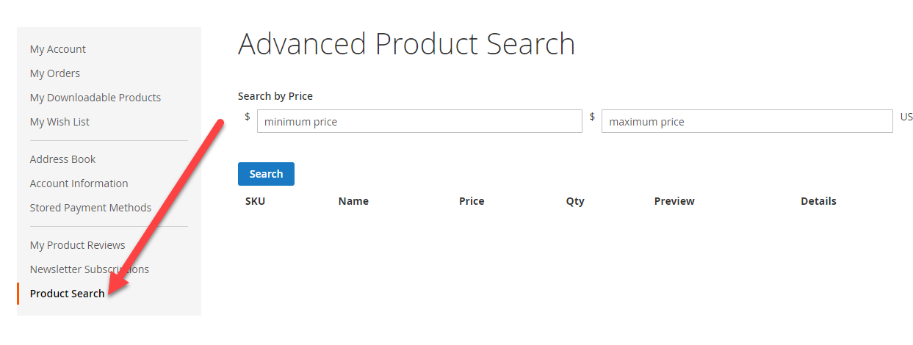
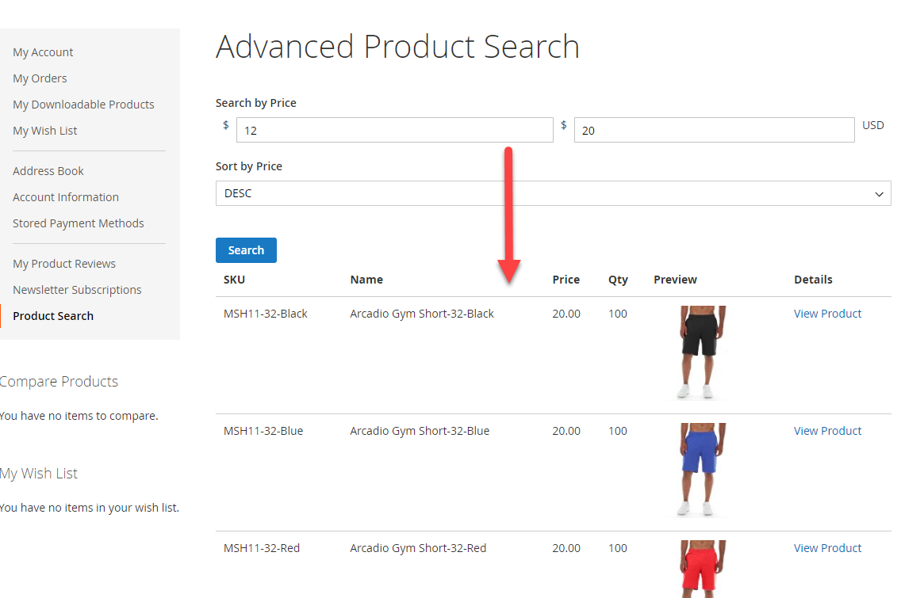

# My Account Filters (m2_customer_filters)


## Description
Add a filters for your loyal customers to browse your catalog within their _My Account_ section. 
Currently, this module allows for filtering by product price based on a minimum and maximum price.
We're looking to add more catalog filters in the future. Only tested on _Adobe Commerce 2.4.5_. 

Don't forget install and deploy static content after importing the module into your Magento instance:

```bash
php bin/magento setup:upgrade
php bin/magento setup:di:compile
php bin/magento setup:static-content:deploy
```

## Table of Contents

- [Installation](#installation)
- [Usage](#usage)
- [License](#license)
- [Tests](#tests)

## Installation

To install this module in your Magento 2.4.5+ instance, simply clone, or download a zip of, this repository, and extract its contents into your `app/code` folder. After installation, you should have a _Product Search_ section added to your customer's _My Account_ page.

## Usage

The long-term goal of this Magento module is to provide customers with the ability of searching the catalog and past customer orders based on purchase history, with a number of assistive filters.

Currently, customers can search for catalog products based on a minimum price and five times the minimum price entered as a min-max range. The search includes validation to ensure customers are following these rules, and it does not accept negative pricing.
Customers can also choose to sort the search by ascending price (default, lowest to highest), or by descending price (highest to lowest).



Once the desired price range is submitted, a list of products matching the customer's search will list the following information:

* The product's SKU
* The product's Name
* The product's available quantity (qty)
* The product's price
* A thumbnail preview of the product
* A link to the product (opens on a new tab)



## Future Development

While, in its current state, the module only provides the means to search the entire catalog from a registered account, the ultimate intent of this module is to allow for enhanced search capabilities based on the customer's previous orders/purchases. Enhancements are under development and will be pushed periodically. Any usability suggestions around this goal are welcome.


## License
Copyright (C) 2023  Thaís Cailet, _aka_ [@thaiscmky](https://github.com/thaiscmky)

[](http://www.gnu.org/licenses/gpl-3.0.en.html)

**m2_customer_filters** is free module: you can redistribute and/or modify it under the terms of the
[GNU General Public License](https://www.gnu.org/licenses/gpl.html) as
published by the Free Software Foundation, either version 3 of the License, or (at your option) any later version.

This program is distributed in the hope that it will be useful, 
but WITHOUT ANY WARRANTY; without even the implied warranty of MERCHANTABILITY or FITNESS FOR A PARTICULAR PURPOSE. 
See the [GNU General Public License](https://www.gnu.org/licenses/gpl.html) for more details.

---

## Tests

To run form validation test (unit test) for this module, use the following command:

```bash
./vendor/bin/phpunit -c ./dev/tests/unit/phpunit.xml.dist app/code/ThaisCmky/CustomerFilters/Test/Unit/ControllerResult.php
```
